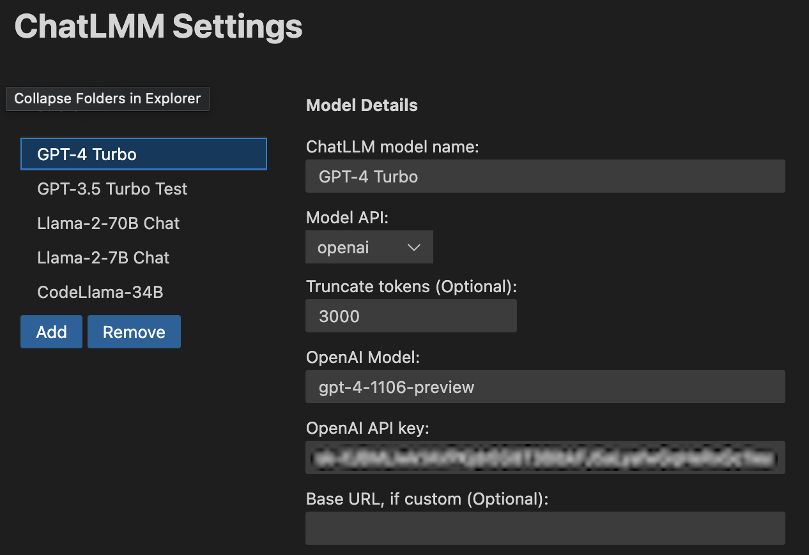
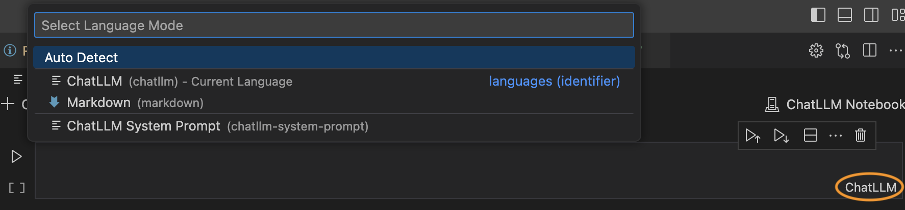
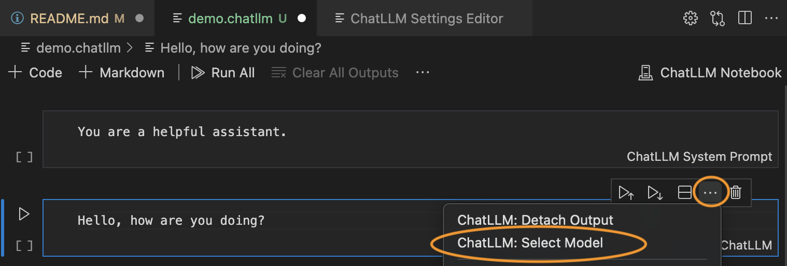
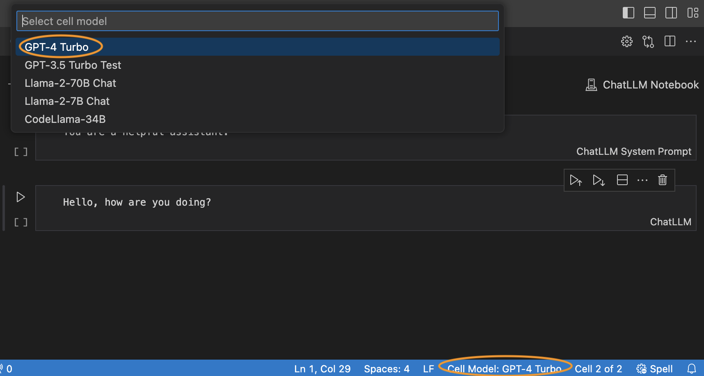

# chatllm-vscode README

ChatLLM is a VSCode extension for interacting with LLM APIs in a flexible and long-form manner.  It leverages the VSCode notebook support to do so, creating a new type of notebook (.chatllm) files where you can interact with an (API-based) LLM system over a long document.  ***Note: this plugin requires you to have your own OpenAI API key (or other LLM API key); it does not work with the free version of ChatGPT.***

Features include:
- Have chat conversations directly within the VSCode IDE, leveraging the existing notebook UX.
- Store and manipulate long-form chat conversations locally, without relying on cloud storage.
- Dynamically expand files into prompts, to update the prompts in response to edits.
- Support for different LLM APIs (currently OpenAI, Together, Google), supporting many different models.

Quick start:
- Install the extension.
- Run the "ChatLLM: Edit Settings" command.
- In the default GPT-4-Turbo model, add your OpenAI API key.
- Create a new notebook file with the extension ".chatllm".
- Add a code cell, type your prompt, and run the cell.  The response will stream back in the cell output.


## Motivation

For the most part, I think that people are using LLMs suboptimally, especially as far as integration into IDEs goes.  There are no shortage of "talk to ChatGPT"-type plugins for VSCode, and GitHub Co-pilot has chat functionality too, but these methods all seem to prioritize short-term one-off questions and code generation rather than long form interaction.

In my experience, the best way to leverage LLMs (for most tasks, but very much thinking of coding as the primary example) is via long-form interaction, thinking of chat logs as "projects" that evolve over long periods of time.  But at the same time, most public interfaces for LLMs are set up quite badly for this: many can't handle long projects at all (they fail to handle truncation, etc), and even the ChatGPT interface, which I usually wind up using, gets extremely laggy as you build a long chat.

Fortunately, the IDE we're virtually all using already has a perfectly good interface to accomplish this goal: the notebook interface.  This plugin defines a new notebook type, the ".chatllm" notebook, that lets you interact with an LLM over long-form discussion using this interface.  I'm writing this as a VSCode plugin instead of e.g. a Jupyter notebook cell magic, (which does also exist incidentally), largely because I want to do development inside an actual IDE.  And while it might make sense to embed these into Jupyter notebooks with an actual Python kernel, in practice I _don't_ want most development work to happen in a notebook, and would rather have a more specific interface that _only_ handles LLMs.

## Installation and setup

Install the extension from the VSCode marketplace. Alternative, you can clone this repo and install the `chatllm-vscode-1.0.0.vsix` file by running the `Extensions: Install from VSIX...` command from within VSCode, on from the command line with the command
```
$ code --install-extension chatllm-vscode-1.0.0.vsix
```

### Setting up models



Once you installed the extension, you need to set up the models to use. To do so, run the `ChatLLM: Edit Settings` command to bring up an interface for creating models.  Right now, three APIs are supported: OpenAI, Together.ai, and Google, and you need to set up the models by specifying the API keys, model names, and whatever other API options you want to specify.  You'll need to use the API versions of the systems for all of this, not just e.g. a ChatGPT account.  

One particularly important settings is the "Truncate tokens" setting.  This will truncate chat history to be at most this many tokens prior to the current message (though always still including system prompts and the last user's input, with the ability to not count the system prompt at all toward the total token count).  This is necessary for models that have a short history, but also important for models that have a longer context, so that you don't wind up spending too much on queries.  Note that this is _not_ a precise truncation: for simplicity, I use the tiktoken tokenizer to count tokens regardless of which model is selected, so the exact token count will differ from the truncation.  And the precise mechanism is that we truncate cells _after_ the first one that exceeds the truncation count.  So if your model has a low context size, you should leave some buffer.


### Using cells and models



Now that you've installed and set up models, you can create or open a `.chatllm`` file.  You can add a new code cell and click the Language in the bottom right corner to select the cell type.  There are three types of supported cells:
  - ChatLLM: the basic LLM input that will send a query to the ChatLLM API when you run it
  - ChatLLM System Prompt: A system prompt cell that will not do anything when you run it, but which will be pre-pended as the system prompt to all further queries in the notebook.
  - Markdown: You can use Markdown cells as you would within any notebook.  These will also be send to the API (treated as user inputs) when you run a command.



To select a model, click on a "ChatLLM" cell and click on the three dots, and choose the "ChatLLM: Select Model" item.  This will bring up a selection list to choose the model you want to use for that cell (from the list of models you created in the Settings view).



The currently-selected model will display in the status bar at the bottom of the VSCode window (I wish it was possible to have this in the cell, where `ChatLLM` is displayed, but VSCode is surprisingly inflexible in this regard).  Once you select a model, later cell you add will by default use that same model as well, so typically you don't need to do this selection process very often, and you can largely forget about it unless you want to explicitly test out different models.

### Running ChatLLM

Once this is set up, to send the chat command just run the cell.  It will display the output in markdown format in the cell.

The mechanism of ChatLLM is that all content _before_ the cell you are running will be sent to the API as a chat interaction (truncated at the appropriate length of tokens you specify).  As mentioned, Markdown cells are treated as user inputs, with one exception.  If you want to edit the previous _output_ of an LLM for future interactions (which is possible, of course), you can select the cell and choose the "ChatLLM: Detach Output" command from the same ellipses menu as you used to select the model.  This will detach the cell output into a separate Markdown cell with the starting identifier `#### (Chat Output)`, which will make that cell be treated as LLM output in the chat interactions.

### Dynamic file inclusion in prompts

To include the contents of a file in your prompt, put the text `{{%% include <filename> }}` into one of your prompts.  Note that the filenames need to be specified relative to the ***currently open VSCode workspace folder***, not relative to the specific location of the notebook.  I have found that this this is particularly useful in the (common) setting where I'm using ChatLLM to develop a code base, but I'm copying portion of the response into my code base, making changes, and maintaining things literal copies of the ChatLLM output.

## Technology

ChatLLM is written as a basic VSCode extension, that includes:
 1. The extension logic, which handles converting the notebook to the proper format, sending to an API, and parsing the (streaming) results.
 2. A custom renderer to view Markdown in a slightly nicer way (e.g. with nicer code and math formatting than the default that VSCode has).
 3. A [webview-ui-toolkit](https://github.com/microsoft/vscode-webview-ui-toolkit) WebView to edit the settings for the extension.

It likely goes without saying at this point, but I do not know how to program in either Javascript or Typescript and prior to this project had never written any node-based package.  But using ChatGPT (and later switching to just using ChatLLM notebook once they were stable enough), I wrote this extension in my (rather limited) spare time over a couple weeks.  Yeah, yeah, I know the code quality is probably awful, and maybe it'll catch up to me if I try to actually maintain this tool.  But come on, building code projects using LLMs is a superpower; it is absurd how easily this enables me to do things that I would never have even attempted before.  Hopefully the tool helps you do similar things.

## Known Issues

The following issues are known:
- At some point, "Undo" functionality in the notebook editor breaks for some commands (like detaching output).  I'll need to look into this.


## Release Notes

### 0.5.0
- Initial private release, just on our lab github. 

### 1.0.0
- Added support for dynamic file inclusion in prompts.
- Added copy buttons to code.
- Initial 